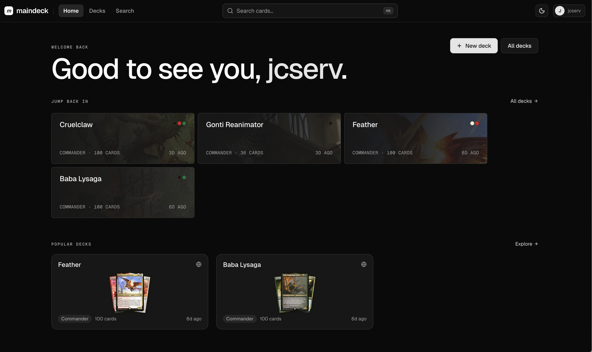
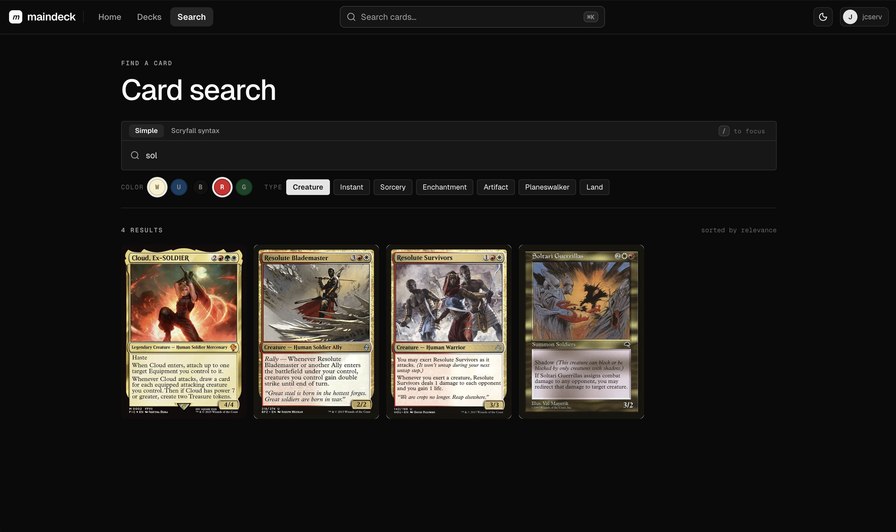
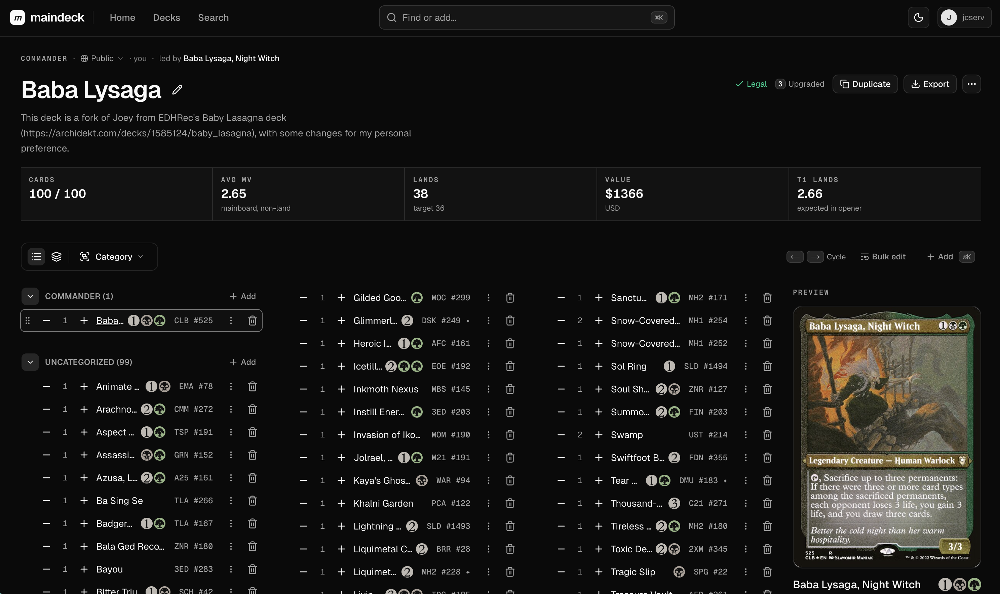
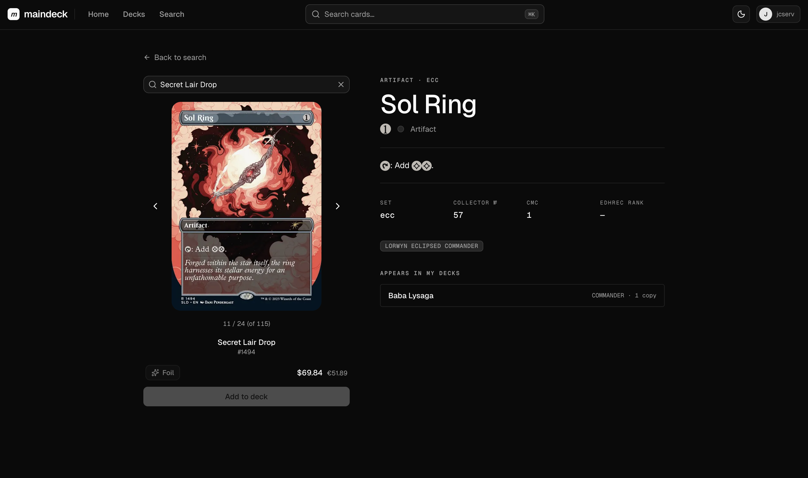
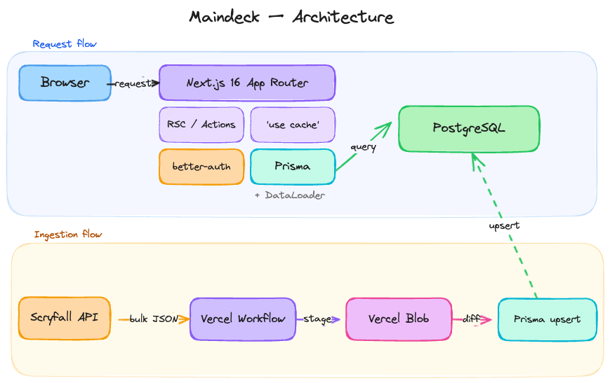

# maindeck 🃏

A fast, no-nonsense Magic: The Gathering deckbuilder. No ads, no feature sprawl, no pay-gates — just the tools you need to brew.

## features 🚀

1. drag-and-drop deck building across mainboard, sideboard, considering, and commander zones
2. format legality + Commander bracket detection
3. deck stats — mana curve, color breakdown, type distribution, opening-hand simulator
4. printing picker with per-set prices (USD/EUR, foil variants)
5. import/export — plaintext, Arena, JSON (maindeck format)
6. public deck exploration with forking
7. visibility-aware deck comparison — diff two decks' cards (added/removed/shared) and stats (mana curve, colors, types, curve)
   > card data is synced from [Scryfall](https://scryfall.com) via a Vercel Workflow; staging goes through Vercel Blob so ingestion doesn't thrash the live DB

## screenshots 📸

|                                                  |                                                          |
| ------------------------------------------------ | -------------------------------------------------------- |
| <br />_home_             | <br />_card search_          |
| <br />_deck editor_  | <br />_card detail_    |

## stack ⚙️



- **framework**: [Next.js 16](https://nextjs.org) (App Router, Cache Components) + React 19
- **db**: Postgres + [Prisma 7](https://www.prisma.io) on Railway
- **auth**: [better-auth](https://www.better-auth.com)
- **email**: [Resend](https://resend.com)
- **ingestion**: [Vercel Workflow](https://vercel.com/docs/workflow) + [Vercel Blob](https://vercel.com/docs/vercel-blob)/S3-compatible storage/local filesystem
- **ui**: Tailwind 4 + Base UI + shadcn, [mana-font](https://mana.andrewgioia.com) for MTG symbols

## getting started ✅

### 1. env

Copy `.env.example` to `.env` and fill in at minimum:

- `DATABASE_URL`, `BETTER_AUTH_SECRET`, `CRON_SECRET`
- `RESEND_API_KEY`, `EMAIL_FROM`
- `BLOB_READ_WRITE_TOKEN` (only if `STAGING_DRIVER=blob`)

### 2. services + deps

```bash
pnpm install            # installs deps; postinstall runs `prisma generate`
pnpm db:up              # postgres via docker compose
pnpm db:migrate         # apply migrations
```

### 3. run it

```bash
pnpm dev                # next.js on :3000
pnpm wf:dev             # (separate terminal) vercel workflow dev server
curl -X POST -H "Authorization: Bearer $CRON_SECRET" http://localhost:3000/api/ingest # ingest data from scryfall
```

## scripts 🧪

```bash
pnpm test               # vitest
pnpm lint               # eslint
pnpm typecheck          # tsc --noEmit
pnpm db:studio          # prisma studio
pnpm analyze            # bundle analyzer
```
