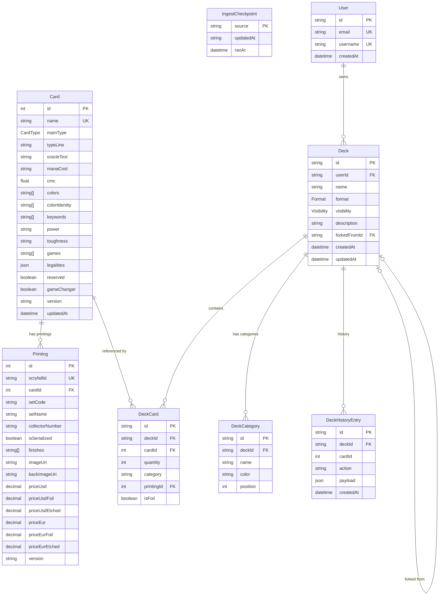

# Maindeck — Architecture

> System design, data model, and key decisions. For feature specs and delivery phases, see [`FEATURES.md`](./FEATURES.md).

---

## Overview

Maindeck is a mobile-first Magic: The Gathering deckbuilder built on **Next.js (App Router)** with **React Server Components**, **Prisma** (PostgreSQL), and **Tailwind CSS v4**. The rendering model is RSC-first: pages are server-rendered by default, with client components used only for interactive islands (deck editor, search input). Mutations go through **Server Actions**, not API routes. The framework is configured with **Cache Components** (`'use cache'` + `cacheLife` + `cacheTag`), **React Compiler**, and **inline CSS** for sub-second navigation.

A nightly **Scryfall ingest pipeline** fetches bulk card data, diffs against the existing database, and upserts changes in batches. The pipeline uses a staging layer (local filesystem in dev, Vercel Blob in production) and checkpointing for resumability. Authentication will be handled by **better-auth** (email/password + magic link), with OAuth providers deferred to v2. The app deploys to **Vercel** with analytics proxied through same-origin rewrites to avoid ad blockers.

---

## System Diagram

Source: [`ARCHITECTURE.excalidraw`](./ARCHITECTURE.excalidraw) · [open on excalidraw.com](https://excalidraw.com/#json=wYXSWMnYdC2QmdVrgMD4t,TgvYhmS_dBqvtnKPZEFX-w)

**Request flow** — Browser hits Next.js 16 (App Router + RSC). Server Actions handle mutations; `'use cache'` boundaries front Redis (via ioredis) for card/search/deck-read caching. `better-auth` manages sessions. Prisma fronts Postgres, with a per-request DataLoader batching N+1 fan-out.

**Ingestion flow** — A Vercel Workflow pulls Scryfall bulk JSON, stages it in Vercel Blob (local FS in dev), diffs against existing rows, and upserts changes back to Postgres.

---

## Data Model

Current models are implemented in `prisma/schema.prisma`. Planned models are defined in [`FEATURES.md`](./FEATURES.md) and shown with dashed borders below.

**Legend:** `Card`, `Printing`, and `IngestCheckpoint` exist today. `User`, `Deck`, `DeckCard`, `DeckCategory` land in Phase 0-1. `DeckHistoryEntry` is post-MVP (F12).

---

## Key Architectural Decisions

1. **RSC by default.** Card lists, deck views, and search results are Server Components. Only interactive surfaces (editor, search input, view-mode toggle) are client components. This keeps client JS minimal — target < 130 KB gzipped on the heaviest route.

2. **Server Actions for mutations.** All writes (deck CRUD, card add/remove, category changes) use Server Actions with `updateTag` for same-request invalidation. No API routes for mutations, no client-side data libraries (no SWR, React Query, or Redux).

3. **Cache Components over legacy caching.** The app uses `'use cache'` + `cacheLife()` + `cacheTag()` instead of `export const revalidate`, `export const dynamic`, or `unstable_cache`. This is enabled via `cacheComponents: true` in `next.config.ts`.

4. **Custom `<Link>` wrapper.** All internal navigation uses `app/_components/link.tsx`, never `next/link` directly. The wrapper adds `onMouseDown` navigation (saves ~100ms vs click), hover prefetch, and per-route image manifest warmup via IntersectionObserver.

5. **React Compiler enabled.** Automatic memoization via `reactCompiler: true` in `next.config.ts`. No manual `useMemo`/`useCallback` needed — the compiler handles it.

6. **Scryfall ingest with staging + checkpointing.** Bulk data is fetched, written to a staging layer in batches, then diffed against existing rows using MD5 hashes. Only changed cards are upserted. `IngestCheckpoint` tracks the last successful run per source for resumability.

7. **Mobile-first, not responsive.** Every component is designed on a 375px viewport first. Bottom-sheet patterns on mobile, side-by-side layouts on desktop. 44px minimum tap targets. This is the primary differentiator from Moxfield and Archidekt.

8. **Privacy by default.** New decks are `PRIVATE`. Unlisted decks are accessible by link but not indexed. Private decks return 404 to non-owners. No social features, no comments, no forums.
